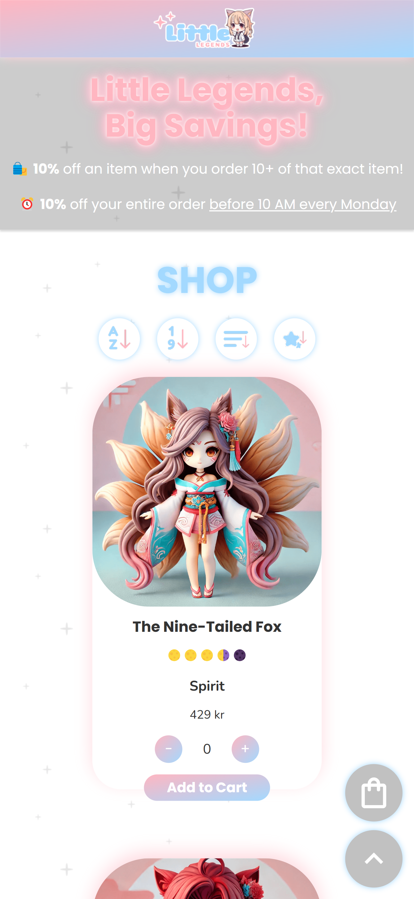
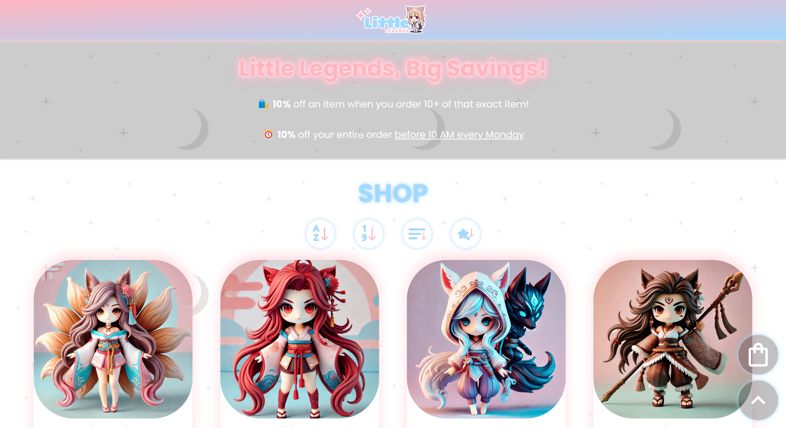
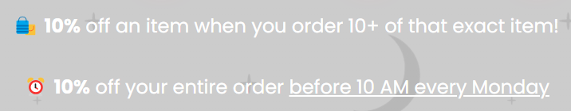
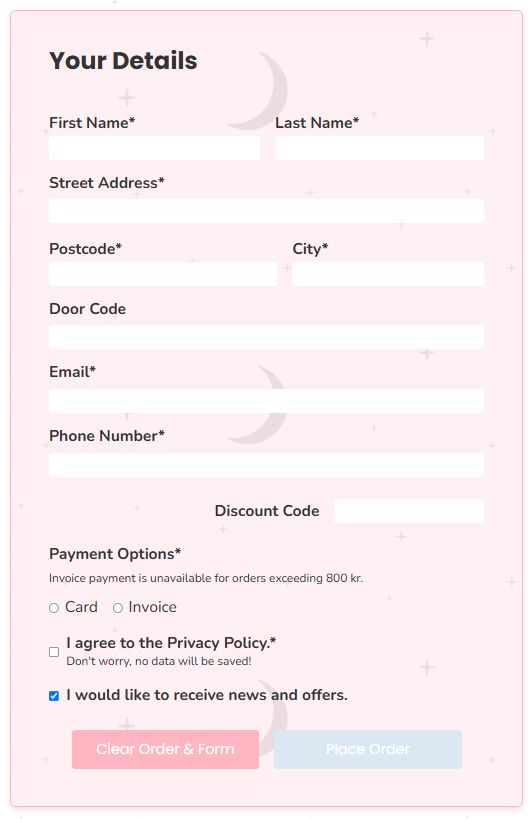
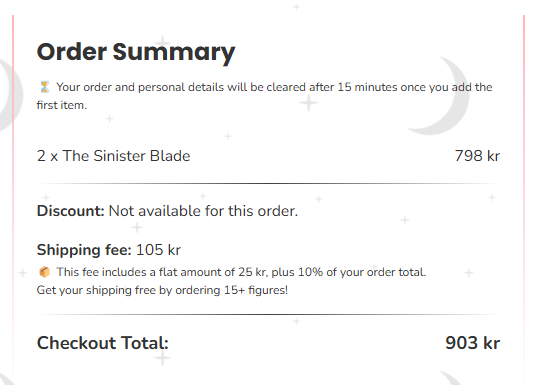
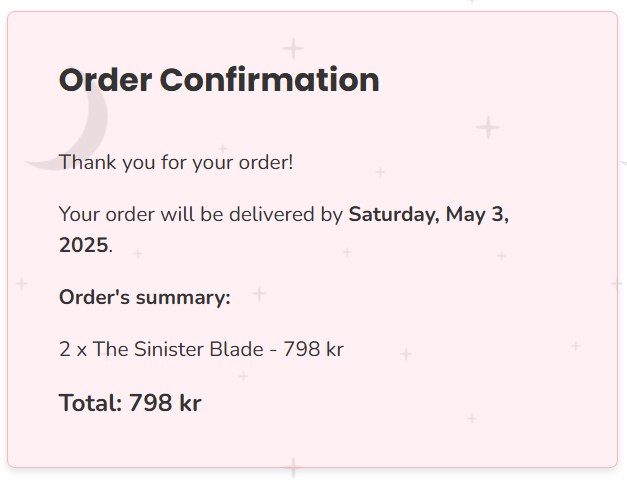
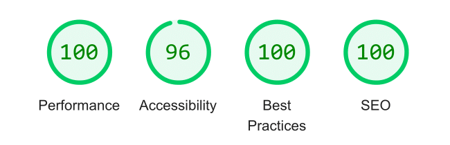

# 🛍️ Little Legends E-Commerce

**🔗 Demo: https://tgvie.github.io/MI-web-store/**

This project features a simple e-commerce built with vanilla JavaScript. Users can browse a list of products, add them to their cart, and place an order. The cart includes quantity controls, dynamic price updates, discount rules, and a form for order details.

<strong>📐 Wireframe & Visual Identity</strong>

| Visual Identity |
| --------------- |
|  |

| Top Page | Bottom Page |
| -------- | ----------- |
|  |  |

<strong>🖼️ Preview</strong>

| 📱 Phone | 💻 Desktop |
| ------------------ | ------------------ | 
|  |  |

### ✨ Featuring

|  |  |  |
| ----------------- | ---------------- | ---------------- |
| <strong>Add product to cart</strong>  | <strong>Sort after alphabet/price/category/rating</strong>  | <strong>Discounts (apply automatically in cart)</strong>  |
| <strong>Order form with validation</strong>  | <strong>Shipping & discount cost calculation</strong>  | <strong>Displays estimated delivery date on confirmation</strong>  |

## 🛠️ Tech Stack

## 📋 Documentation

<strong>Lighthouse Report</strong>

| Desktop |
| ------- |
|  |

<strong>Code Validation</strong>

| HTML | CSS |
| ---- | --- |
|  |  |
|  |  |

  
## ✍️ Author/s
🧑‍💻 [@tgvie](https://github.com/tgvie)

